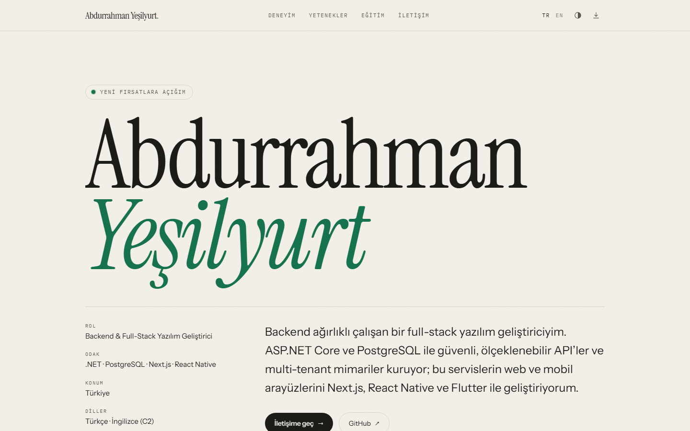

<div align="center">

# abdurrahmanyesilyurt.com

Source code of my personal CV website — **[abdurrahmanyesilyurt.com](https://www.abdurrahmanyesilyurt.com)**

[](https://github.com/abdurrahmanyesilyurt/abdurrahmanyesilyurt.com/actions/workflows/ci.yml)


[](LICENSE)

</div>

<picture>
  <source media="(prefers-color-scheme: dark)" srcset=".github/assets/screenshot-dark.png">
  
</picture>

## Features

- **Bilingual.** Turkish at `/`, English at `/en/`, with `hreflang` alternates and a sitemap.
- **One content file.** All CV data lives in a typed [`src/data/cv.ts`](src/data/cv.ts); both languages sit side by side.
- **Print-ready.** <kbd>Ctrl</kbd>+<kbd>P</kbd> (or the download button) produces a clean, one-page A4 PDF of the CV.
- **Light and dark themes** that follow the system setting, with a manual toggle.
- **Static and fast.** No client-side framework; the only JavaScript is a sub-1 KB theme toggle.
- **Accessible.** Semantic HTML, skip link, visible focus states and `prefers-reduced-motion` support.
- **Search- and share-friendly.** Canonical URLs, Open Graph image and schema.org `Person` data.

## Security

The site is static, but it is configured like a production application.

| Area | What's in place |
| --- | --- |
| Content Security Policy | `default-src 'none'` without `'unsafe-inline'`: every script, style and font is served from the site's own origin. [`scripts/check-csp.mjs`](scripts/check-csp.mjs) fails CI if inline code ever appears in the build. |
| HTTP headers | HSTS (2 years), `X-Frame-Options: DENY` with `frame-ancestors 'none'`, `nosniff`, `Referrer-Policy`, `Permissions-Policy`, COOP and CORP. See [`vercel.json`](vercel.json). |
| Privacy | Fonts are bundled with the site. No analytics, trackers, cookies or third-party requests. |
| Supply chain | Dependabot version and security updates, GitHub Actions pinned to commit SHAs, read-only workflow token. |
| Code scanning | CodeQL analysis, secret scanning with push protection. |
| Disclosure | [`SECURITY.md`](SECURITY.md) and [`/.well-known/security.txt`](public/.well-known/security.txt) (RFC 9116) with private vulnerability reporting. |

Check it yourself on [securityheaders.com](https://securityheaders.com/?q=www.abdurrahmanyesilyurt.com&followRedirects=on) or [Mozilla Observatory](https://developer.mozilla.org/en-US/observatory/analyze?host=www.abdurrahmanyesilyurt.com).

## Tech stack

[Astro 7](https://astro.build) (static output) · [Tailwind CSS 4](https://tailwindcss.com) · TypeScript · [Fontsource](https://fontsource.org) (Instrument Serif, Instrument Sans, IBM Plex Mono) · [Vercel](https://vercel.com) · GitHub Actions

## Project structure

```text
src/
├── data/cv.ts           # all CV content (TR + EN)
├── i18n/ui.ts           # interface strings
├── components/          # page sections (Hero, Experience, Skills, ...)
├── layouts/Base.astro   # <head>: meta tags, fonts, structured data
├── pages/               # / (Turkish), /en/ (English), 404
└── styles/global.css    # design tokens, animations, print styles
public/
├── site.js              # theme toggle — the only script on the site
└── .well-known/security.txt
scripts/check-csp.mjs    # CI guard for the Content Security Policy
vercel.json              # security headers and caching
```

## Local development

Requires Node.js 22.12 or newer.

```sh
npm install
npm run dev         # http://localhost:4321
npm run check       # type-check
npm run build       # static output in dist/
npm run check:csp   # make sure the build works under the strict CSP
```

## Updating the CV

Edit [`src/data/cv.ts`](src/data/cv.ts). Each text field is either a plain string (the same in both languages) or a `{ tr, en }` pair. Adding an entry to `projects` makes the Projects section appear automatically.

## Deployment

Vercel builds and deploys every push to `main`, and every pull request gets a preview deployment. Headers and caching rules live in [`vercel.json`](vercel.json).

## License

The code is available under the [MIT License](LICENSE). The CV content in `src/data/cv.ts` and all personal information are © Abdurrahman Yeşilyurt and are not covered by the license.
